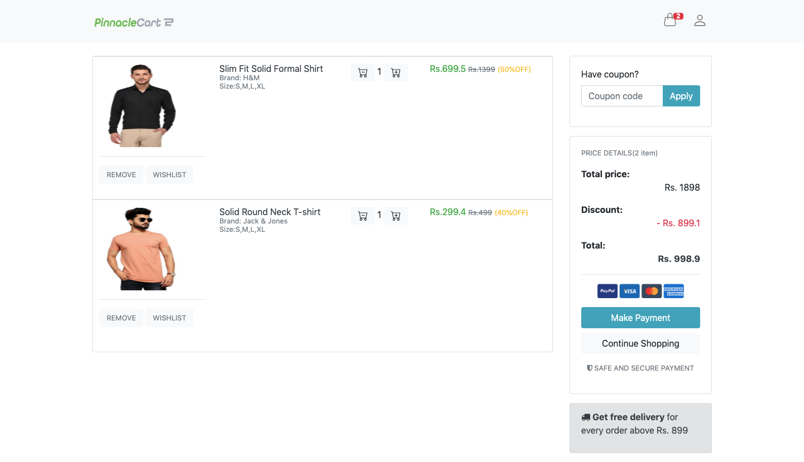
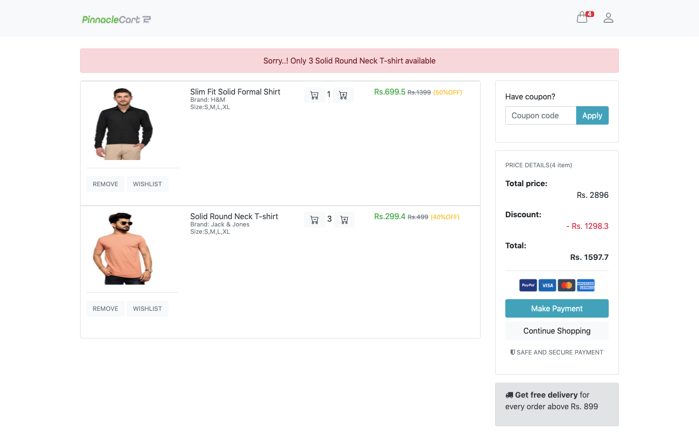

# Add-to-cart
Add to Cart is a way to create a temporary list of items by adding them to your cart, which will keep track of the items until you leave e-commerce website.

### 1.Add Products To Cart

### 2.Product Cart Items

### 3.Product Quantity Notification

### 4.Empty Cart

